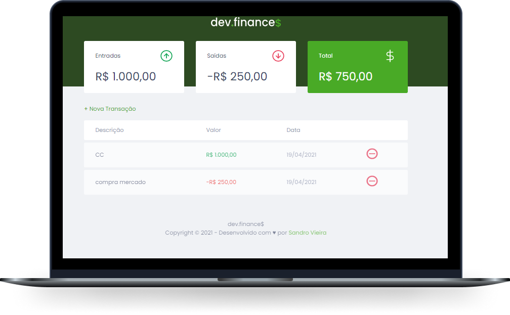

# 

## Tecnologias

Projeto desenvolvido utilizando as seguintes tecnologias:

- HTML
- CSS
- JavaScript
- Armazenamento via localStorage em formato JSON

## Projeto

O dev.finances é uma aplicação de controle financeiro, sendo possível incluir e excluir transações de débito (saída) e crédito (entrada), a aplicação também apresenta o saldo final de cada operação.

Projeto desenvolvido durante a [Maratona Discover](https://maratonadiscover.rocketseat.com.br/), realizada pela [@Rocketseat](https://github.com/Rocketseat).


## Instalação e Execução.

- [Clone](https://help.github.com/articles/cloning-a-repository/) o projeto na sua máquina executando o seguinte comando no seu terminal:

```sh
git clone https://github.com/vsandro/dev-finances.git
```

**Execução**

- Execute o arquivo
```sh
Index.html
```


## Licença

Esse projeto está sob a licença MIT. Veja o arquivo LICENSE para mais detalhes.

---

Desenvolvido com :heart: por [Sandro Vieira](https://www.linkedin.com/in/vsandro) 